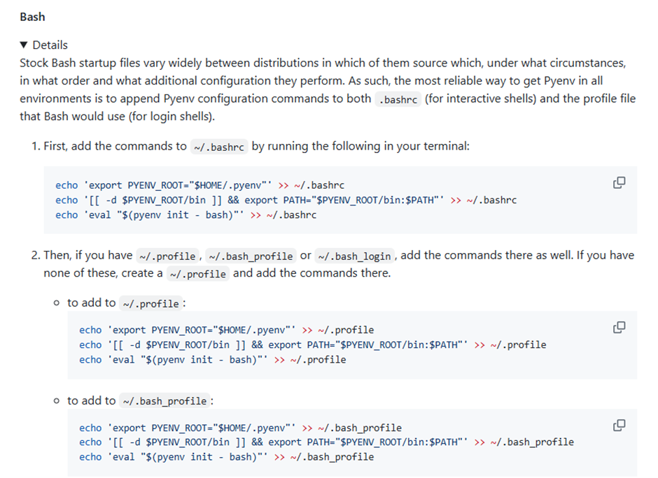

# MLOPSEndtoEnd
Entire cycle of MLOPS

Setup pyenv
url: -  https://github.com/pyenv/pyenv?tab=readme-ov-file#installation
1. Download/ Getting Pyenv
      curl -fsSL https://pyenv.run | bash
2. Set up your shell environment for Pyenv
      
3. Restart your shell
    exec "$SHELL"
4. Install pyton version 3.11.8 using pyenv command
      pyenv install 3.11.8
       if install successfully it will show as below.
	   
5. Please run below command if you face issue in above command 
   pyenv will try its best to download and compile the wanted Python version, but sometimes compilation fails because of unmet system dependencies, or compilation succeeds but the new Python version exhibits weird failures at runtime. The following instructions are our recommendations for a sane build environment.

    url :- Home · pyenv/pyenv Wiki · GitHub
 
7. Check Python version it will as below.
	 
8. To make Python 3.11.8 the default version across your entire system (whenever you open a new terminal), use the following command
	pyenv global 3.11.8

9. clone the book repository and navigate to it
	$ git clone https://github.com/PacktPublishing/LLM-Engineers-Handbook.git
    $ cd LLM-Engineers-Handbook/

    cross check the python version to ensure that python version 
    $ python –version
 
 
10. Poetry for dependency management Poetry
	a) Install 
        url : https://python-poetry.org/docs/#installing-with-the-official-installer
        Command :-   curl -sSL https://install.python-poetry.org | python3 -
	

			

	Output as below:

	Setup to add in path or call direct
	Direct call ( without setup)
•	Code:- /home/sysadmin/.local/bin/poetry --version
	Setup poetry so that no need to use the path every time.
•	Setup 
 				    export PATH="/home/sysadmin/.local/bin:$PATH"

	b) once installation done 
	Verify Poetry installation
•	code :-  poetry --version
•	output:- 

	Set up the project environment and install dependencies
	Code:- poetry env use 3.11
it will create virtual environment
 

	Code:- poetry install --without aws
it will install all dependencies of the project
 
	Code:- poetry run pre-commit install
Set up pre-commit hooks for code verification
 

Poe the Poet
https://poethepoet.natn.io/index.html
Activate peothepoet
      poetry self add 'poethepoet[poetry_plugin]'
 

c) Activate the Environment 
	url : https://python-poetry.org/docs/managing-environments/#bash-csh-zsh
1.	Start a Poetry shell:
eval $(poetry env activate)
2. check the environment information
       poetry env info
 

 
Docker setup
url : - https://docs.docker.com/desktop/setup/install/linux/ubuntu/
For non-Gnome Desktop environments, gnome-terminal must be installed:
$ sudo apt install gnome-terminal
Install using the apt repository
url:-  https://docs.docker.com/engine/install/ubuntu/#install-using-the-repository

Install the Docker packages.
$ sudo apt-get install docker-ce docker-ce-cli containerd.io docker-buildx-plugin docker-compose-plugin
Verify that the installation is successful by running the hello-world image:
$ sudo docker run hello-world

After you’ve successfully installed Docker Desktop, you can check the versions of these binaries by running the following commands:
$ docker compose version
$ docker --version
 
Add certificate 
$ sudo apt-get install docker-ce

Start docker, mangodb, quadrant and Zenml
$ poetry poe local-infrastructure-up
Connect ZenML from remote server to local server.
   Open command prompt and type below.
    cmd:-  ssh -L 8237:localhost:8237 sysadmin@20.127.218.35
   then open browser and type http://127.0.0.1:8237 to check ZenML browser
Install Chrome in Ubuntu
$ wget https://dl.google.com/linux/direct/google-chrome-stable_current_amd64.deb
$ sudo apt -y install ./google-chrome-stable_current_amd64.deb
$ google-chrome –version

Execute to extract the data from different link with/without user id
$ poetry poe run-digital-data-etl
 
# Login to ubuntu server
Cmd:- ssh -i ~/.ssh/id_rsa.pem sysadmin@20.127.218.35

# run to load the environment variable
$ source ~/.bashrc

# to set PATH of  poetry if not working above
$ export PATH="/home/sysadmin/.local/bin:$PATH"

$ cd mukesh/MLOPSEndtoEnd/
# activate poetry to start the virtual environment
$ eval $(poetry env activate)

# start docker and zenml together.
$ peotry peo local-infrastructure-up

# to start the zenml service inside the docker
zenml login --local –docker

 
About click 
Click is a Python package for creating beautiful command line interfaces in a composable way with as little code as necessary. It's the "Command Line Interface Creation Kit". It's highly configurable but comes with sensible defaults out of the box.
It aims to make the process of writing command line tools quick and fun while also preventing any frustration caused by the inability to implement an intended CLI API.
Click in three points:
•	Arbitrary nesting of commands
•	Automatic help page generation
•	Supports lazy loading of subcommands at runtime

