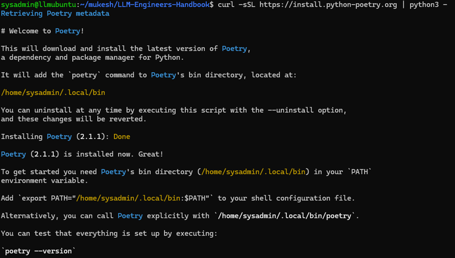

# MLOPSEndtoEnd
Entire cycle of MLOPS

Setup pyenv
url: -  https://github.com/pyenv/pyenv?tab=readme-ov-file#installation
1. Download/ Getting Pyenv
    ```bash
      $ curl -fsSL https://pyenv.run | bash
    ```
2. Set up your shell environment for Pyenv - for Bash
	  Stock Bash startup files vary widely between distributions in which of them source
	  which, under what circumstances, in what order and what additional configuration they perform.
	  As such, the most reliable way to get Pyenv in all environments is to append Pyenv
	  configuration commands to both `.bashrc` (for interactive shells)
	  and the profile file that Bash would use (for login shells).
	
	  1. First, add the commands to `~/.bashrc` by running the following in your terminal:
	
	      ```bash
	      echo 'export PYENV_ROOT="$HOME/.pyenv"' >> ~/.bashrc
	      echo '[[ -d $PYENV_ROOT/bin ]] && export PATH="$PYENV_ROOT/bin:$PATH"' >> ~/.bashrc
	      echo 'eval "$(pyenv init - bash)"' >> ~/.bashrc
	      ```
	  2. Then, if you have `~/.profile`, `~/.bash_profile` or `~/.bash_login`, add the commands there as well.
	     If you have none of these, create a `~/.profile` and add the commands there.
	
	     * to add to `~/.profile`:
	       ``` bash
	       echo 'export PYENV_ROOT="$HOME/.pyenv"' >> ~/.profile
	       echo '[[ -d $PYENV_ROOT/bin ]] && export PATH="$PYENV_ROOT/bin:$PATH"' >> ~/.profile
	       echo 'eval "$(pyenv init - bash)"' >> ~/.profile
	       ```
	     * to add to `~/.bash_profile`:
	       ```bash
	       echo 'export PYENV_ROOT="$HOME/.pyenv"' >> ~/.bash_profile
	       echo '[[ -d $PYENV_ROOT/bin ]] && export PATH="$PYENV_ROOT/bin:$PATH"' >> ~/.bash_profile
	       echo 'eval "$(pyenv init - bash)"' >> ~/.bash_profile
	       ```
	
   **Bash warning**: There are some systems where the `BASH_ENV` variable is configured
   to point to `.bashrc`. On such systems, you should almost certainly put the
   `eval "$(pyenv init - bash)"` line into `.bash_profile`, and **not** into `.bashrc`. Otherwise, you
   may observe strange behaviour, such as `pyenv` getting into an infinite loop.
   See [#264](https://github.com/pyenv/pyenv/issues/264) for details.

3. Restart your shell
  ```bash
    exec "$SHELL"
  ```
4. Install pyton version 3.11.8 using pyenv command.
```bash
pyenv install 3.11.8
```

if install successfully it will show as below.


5. Please run below command if you face issue in above command 
   pyenv will try its best to download and compile the wanted Python version, but sometimes compilation fails because of unmet system dependencies, or compilation succeeds but the new Python version exhibits weird failures at runtime. The following instructions are our recommendations for a sane build environment.
```bash
sudo apt update; sudo apt install build-essential libssl-dev zlib1g-dev \
libbz2-dev libreadline-dev libsqlite3-dev curl git \
libncursesw5-dev xz-utils tk-dev libxml2-dev libxmlsec1-dev libffi-dev liblzma-dev
```
    url :- [Home · pyenv/pyenv Wiki · GitHub](https://github.com/pyenv/pyenv/wiki#suggested-build-environment)
 
7. Check Python version it will as below.

	
	 
8. To make Python 3.11.8 the default version across your entire system (whenever you open a new terminal), use the following command
	```bash
		$ pyenv global 3.11.8
	```

9. clone the book repository and navigate to it
	$ git clone https://github.com/PacktPublishing/LLM-Engineers-Handbook.git
    $ cd LLM-Engineers-Handbook/

    cross check the python version to ensure that python version 
	```bash
    $ python –version
	```

	
 
10. Poetry for dependency management Poetry
	a) Install 
	url : https://python-poetry.org/docs/#installing-with-the-official-installer
	```bash
	$ curl -sSL https://install.python-poetry.org | python3 -
	```
	Help Document.

	


	Output as below.

	

	Setup to add in path or call direct
	1. Direct call ( without setup)
	```bash
	/home/sysadmin/.local/bin/poetry --version
	```
	2. Setup poetry so that no need to use the path every time
	```bash
	$ export PATH="/home/sysadmin/.local/bin:$PATH"
	```
	b) once installation done 
	
	Verify Poetry installation
	```bash
	$ poetry --version
	```
	output. 
	
	

	Set up the project environment and install dependencies
	```bash
	$ poetry env use 3.11
	```
	it will create virtual environment.

	

	```bash
	$ poetry install --without aws
	```
	it will install all dependencies of the project.

	

	Set up pre-commit hooks for code verification
	```bash
	$ poetry run pre-commit install
	```
	
	
11. Poe the Poet
	https://poethepoet.natn.io/index.html
	Activate peothepoet
	```bash
    $ poetry self add 'poethepoet[poetry_plugin]'
	```
	output.

	

	Activate the Environment 
	url : https://python-poetry.org/docs/managing-environments/#bash-csh-zsh
	Start a Poetry shell:
	```bash
	$ eval $(poetry env activate)
	```
	check the environment information
	```bash
    $ poetry env info
    ```

	


## **Docker setup**

url : - https://docs.docker.com/desktop/setup/install/linux/ubuntu/

For non-Gnome Desktop environments, gnome-terminal must be installed.
```bash
$ sudo apt install gnome-terminal
```

Install using the apt repository.
url:-  https://docs.docker.com/engine/install/ubuntu/#install-using-the-repository


Install the Docker packages.
```bash
$ sudo apt-get install docker-ce docker-ce-cli containerd.io docker-buildx-plugin docker-compose-plugin
```

Verify that the installation is successful by running the hello-world image
```bash
$ sudo docker run hello-world
```
output.


After you’ve successfully installed Docker Desktop, you can check the versions of these binaries by running the following commands:
```bash
$ docker compose version
$ docker --version
```

output 


Add certificate 
```bash
$ sudo apt-get install docker-ce
```

Start docker, mangodb, quadrant and Zenml
```bash
$ poetry poe local-infrastructure-up
```
Connect ZenML from remote server to local server.
   Open command prompt and type below.
   ```bash
   $ ssh -L 8237:localhost:8237 user@ip
   ```
   then open browser and type http://127.0.0.1:8237 to check ZenML browser

Install Chrome in Ubuntu
```bash
$ wget https://dl.google.com/linux/direct/google-chrome-stable_current_amd64.deb
$ sudo apt -y install ./google-chrome-stable_current_amd64.deb
$ google-chrome –version
```

Execute to extract the data from different link with/without user id
```bash
$ poetry poe run-digital-data-etl
```


## ** Once Setup done use to run the command to execute the program **
Login to ubuntu server
```bash
ssh -i ~/.ssh/id_rsa.pem user@ip
```
run to load the environment variable
```bash
$ source ~/.bashrc
```
to set PATH of  poetry if not working above
```bash
$ export PATH="/home/sysadmin/.local/bin:$PATH"
$ cd mukesh/MLOPSEndtoEnd/
```
activate poetry to start the virtual environment
```bash
$ eval $(poetry env activate)
```
start docker and zenml together.
```bash
$ peotry peo local-infrastructure-up
```
to start the zenml service inside the docker
```bash
zenml login --local –docker
```

## ** how to install UI in Ubuntu **
```bash
sudo apt-get update
sudo DEBIAN_FRONTEND=noninteractive apt-get -y install xfce4
sudo apt install xfce4-session
sudo apt-get -y install xrdp
sudo systemctl enable xrdp
sudo adduser xrdp ssl-cert
echo xfce4-session >~/.xsession
sudo service xrdp restart
sudo passwd <username>
```


